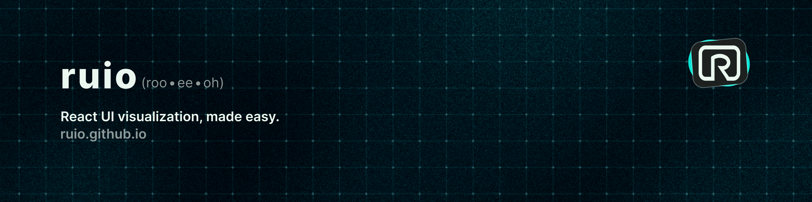

<div align="center">
  <a href="https://www.npmjs.com/package/ruio">
    
  </a>
</div>

> ⚠️ **Disclaimer**: Ruio is currently in an unstable state and is still under active development. Features, UI, and behaviors may change frequently. Use it with caution (for now :D).

<div align="center">
  <h1 align="center">ruio</h1>
  <h3 align="center">Lightweight React DOM troubleshooter</h3>

  <p>
    
    
    
  </p>

  <p>
    <strong>Instantly visualize React component hierarchy</strong> with dynamic border outlines—like Chrome DevTools for your component tree.
  </p>

  <div style="margin: 2rem 0;">
    <video
      src="https://github.com/user-attachments/assets/1b226b6d-6bf1-43ed-b016-d685baa722b6"
      controls
      style="max-width: 800px; width: 100%; border-radius: 8px; box-shadow: 0 4px 12px rgba(0,0,0,0.15);">
    </video>
    <p style="margin-top: 0.5rem; color: #666; font-size: 0.9em;">
      <em>Exploring Excalidraw's UI structure with ruio</em>
    </p>
  </div>

</div>

<p align="center">
  A developer tool for React applications that provides instant visual feedback to help you identify layout issues, understand nested structures, and refine your UI—all without opening DevTools.
</p>

## Features

- **Dynamic Border Styling**: Visualize borders on any element within your React app.
- **Element Selection Mode**: Mimics the hover effect of Chrome DevTools to highlight elements on the page.
- **Click-to-Select**: Make any element the new root with a click.
- **Toggle Logic**: Enable and disable border styling on the fly as well as memory of selected root element.
- **Reset Functionality**: Automatically clear all applied border styles.
- **Highly Configurable**: Works with different project structures and exists on top of any existing architectures.

## Table of Contents

- [Installation](#installation)
- [Usage](#usage)
- [Configuration](#configuration)
- [Documentation](#documentation)
- [Development](#development)
- [License](#license)
- [Contributing](#contributing)

## Installation

You can install Ruio using your preferred package manager:

```bash
# npm
npm install ruio

# yarn
yarn add ruio

# bun
bun add ruio
```

## Usage

To get started with Ruio, wrap your application in the RuioContextProvider:

```javascript
// App.tsx
import RuioContextProvider from 'ruio'

function App() {
  return <RuioContextProvider>{/* Your App Components Here */}</RuioContextProvider>
}

export default App
```

As long as youre in a development environment the `ruio` toggle icon will render. This button allows you to enable or disable the border visualization mode.

Now, once the toggle button is clicked, you’ll be able to hover over elements in your app's DOM tree and see real-time UI insights being applied.

## Configuration

Ruio is slated for a configurative UI soon! Check back for new customized options such as:

- Outline UI depth selection.
  - Crawl deeper down the DOM tree
  - Option to crawl up the DOM tree
  - Simultaneously crawl the DOM upwards and downwards
- Color theming
- Keyboard macros for accessibility (+ key binding)

### Element Exclusion

Applying `ruio-exclude` class to elements that you don't want to be considered for ruio's UI styling (inclusive). Any descendant of a component with the `ruio-exclude` class will also be excluded from ruio styling.

```html
<div className="ruio-exclude">{/* Content that shouldn't be affected by Ruio */}</div>
```

## Documentation

For detailed information and guides, check out the following documentation:

- **[API Reference](./docs/API.md)** - Complete API documentation for components and hooks
- **[Contributing Guide](./docs/CONTRIBUTING.md)** - Guidelines for contributing to the project
- **[Changelog](./docs/CHANGELOG.md)** - Version history and release notes

## Development

### To start developing Ruio locally:

1. Clone the repository:

```bash
git clone https://github.com/gary-rivera/ruio.git
```

2. Install dependencies using your preferred package manager:

```bash
# npm
npm install

# yarn
yarn install

# bun
bun install
```

3. Start the development server:

```bash
# npm
npm run dev

# yarn
yarn dev

# bun
bun run dev
```

4. You can also run tests to ensure everything is working correctly:

```bash
# npm
npm run test

# yarn
yarn test

# bun
bun test
```

### Trying it out

You can test ruio with the example React project:

react-redux-realworld-example-app [repo](https://github.com/gothinkster/react-redux-realworld-example-app)

_Note: since the referenced project is no longer maintained, you may have to use the `--force` flag to override dependency conflicts_

## Contributing

We welcome contributions! Please see our [Contributing Guide](./docs/CONTRIBUTING.md) for details on how to get started.

## License

`ruio` is licensed under the MIT License. See the [LICENSE](./LICENSE) file for more details.
